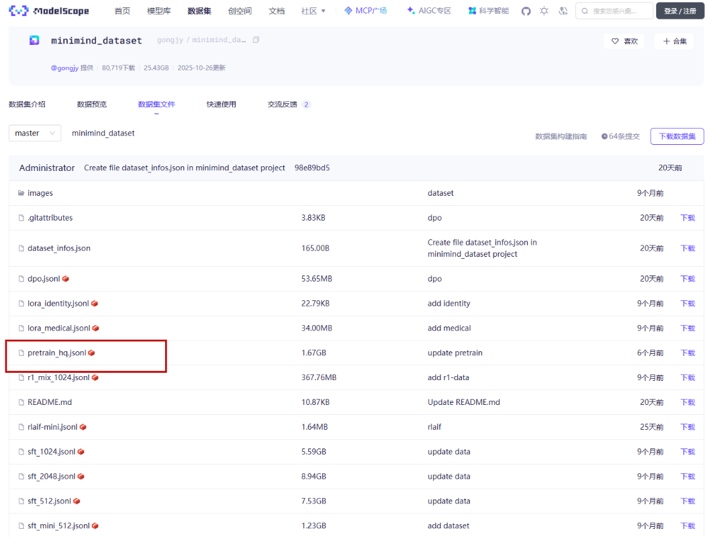

# 大模型原理与实践
本教程在介绍大模型原理的同时，也会讲解如何书写代码与代码运行
## 环境准备
拉取仓库<br>
`git clone https://github.com/jingyaogong/minimind.git`<br>
随后创建自己的环境<br>
`conda create -n <你的环境名字>`<br>
启动环境<br>
`cd minimind`<br>
`conda activate <你的环境名字>`<br>
最后安装包<br>
`pip install -r requirements.txt`<br>
##  第一章 分词
分词器是大模型预训练的初始步骤，大模型的训练的一般过程为将句子映射为相对应的词元id、词元id经过嵌入层映射为嵌入向量、并经过transformer层和前馈神经网络模块后，输出相应的结果。因此在给大模型训练前，需要先训练一个分词器
### BPE分词器
目前大模型训练普遍使用的分词器算法为BPE：BPE 算法的核心在于重复地将语料库中最常出现的相邻字节对合并成一个新的、更长的符号（Token）。
1. 输入： 一个大规模的文本语料库
2. 目标： 达到预定的词汇表大小（例如vocab_size=6400）。
3. 过程（训练）：
4. 初始化词汇表为所有单个字节（基础词汇）。
4. 扫描整个语料库，统计所有相邻符号对的出现频率。
4. 选择频率最高的相邻符号对，将其合并成一个新的符号，并添加到词汇表中。
重复步骤 2 和 3，直到达到目标词汇表大小。<br>
我们先打开分词器代码，先
`cd scripts`<br>
然后找到train_tokenizer.py文件，可以看到BPE分词器的定义代码
```
    #json数据文件地址
    data_path = '../dataset/pretrain_hq.jsonl'
    # 初始化tokenizer
    tokenizer = Tokenizer(models.BPE())
    tokenizer.pre_tokenizer = pre_tokenizers.ByteLevel(add_prefix_space=False)
    # 定义特殊token
    special_tokens = ["<unk>", "<s>", "</s>"]
    # 设置训练器并添加特殊token
    trainer = trainers.BpeTrainer(
        vocab_size=6400,
        special_tokens=special_tokens,  # 确保这三个token被包含
        show_progress=True,
        initial_alphabet=pre_tokenizers.ByteLevel.alphabet()
    )
    # 读取文本数据
    texts = read_texts_from_jsonl(data_path)
    # 训练tokenizer
    tokenizer.train_from_iterator(texts, trainer=trainer)
    # 设置解码器
    tokenizer.decoder = decoders.ByteLevel()
    # 检查特殊token的索引
    assert tokenizer.token_to_id("<unk>") == 0
    assert tokenizer.token_to_id("<s>") == 1
    assert tokenizer.token_to_id("</s>") == 2
    # 保存tokenizer
    tokenizer_dir = "../model/minimind_tokenizer"
    os.makedirs(tokenizer_dir, exist_ok=True)
    tokenizer.save(os.path.join(tokenizer_dir, "tokenizer.json"))
    tokenizer.model.save("../model/minimind_tokenizer")
```
在以上代码中是设置了ByteLevel：<br>
`tokenizer.pre_tokenizer = pre_tokenizers.ByteLevel(add_prefix_space=False)`<br>
ByteLevel 预分词/解码器（ByteLevel Pre-tokenizer/Decoder）是 Hugging Face 的 tokenizers 库中实现的一种分词策略，它最初是为了配合 GPT-2、RoBERTa 等模型，解决传统 BPE 分词的局限性而设计的。在标准的 BPE 流程开始之前，预分词器会将原始文本进行第一次分解。BytLevel 的作用： 它会将输入文本中的每一个字符（包括空格和标点符号）映射到其对应的 UTF-8 字节表示，并将这些字节视为最基本的、不可再分的初始“符号”
#### 上下文感知
config这一数据结构是设置分词器相关参数的，其作用如下所示：
| 参数 | 值 | 说明 |
|------|----|------|
| tokenizer_class | PreTrainedTokenizerFast | 定义加载器：告诉 transformers 库在加载此分词器时应该使用哪个 Python 类。PreTrainedTokenizerFast 是加载基于 Rust 的高性能 tokenizers 库模型的标准类。 |
| model_max_length | 32768 | 上下文长度限制：定义模型能够处理的最大序列长度，用于在编码长文本时进行截断或填充。 |
| legacy | True | 兼容性标志：用于确保分词器在旧版或特定版本的 transformers 库中能正确运行。 |
| unk_token | "<unk>" | 未知 Token：定义用于替换无法识别字符的符号。ByteLevel BPE 通常不会生成它，但必须定义。 |
| bos_token | "<s>" | 句子开始 Token：标记序列开头的符号（Begin Of Sentence）。 |
| eos_token | "</s>" | 句子结束 Token：标记序列结束的符号（End Of Sentence）。 |
| pad_token | "<unk>" | 填充 Token：用于将不同长度的序列填充到相同长度，这里复用了 <unk>。 |
| additional_special_tokens | [] | 额外特殊 Token：用于存放除了上述核心 Token 之外的其他特殊符号，例如 <sep> 或 <mask>，本例中没有。 |
| add_bos_token | False | 自动添加 BOS：控制在调用编码方法时是否默认在输入序列开头添加 bos_token (<s>)，False 表示需要手动添加。 |
| add_eos_token | False | 自动添加 EOS：控制是否默认在输入序列结尾添加 eos_token (</s>)，False 表示由用户或模板控制。 |
| add_prefix_space | False | 前缀空格：控制是否在第一个 Token 前添加空格，与 ByteLevel 预分词器中的设置保持一致。 |
| clean_up_tokenization_spaces | False | 空格清理：控制解码时是否清理多余空格（例如句号前），False 保持字节级忠实还原。 |
| spaces_between_special_tokens | False | 特殊 Token 间的空格：解码时是否在特殊 Token 之间添加空格，False 确保紧密相连。 |
| added_tokens_decoder | {...} | 解码器映射：提供 ID 到 Token 的映射，用于特殊 Token。保证即使没有完整词汇表，这些特殊符号也能被正确识别。示例：ID 0: <unk>、1: <s>、2: </s>。 |
| chat_template | "{% if messages...}" | 最重要的作用：定义一个 Jinja 模板，用于 tokenizer.apply_chat_template() 方法将对话历史（messages 列表）转换为模型可读取的单行字符串。 |

chat_template 将整个对话历史（包括系统指令、所有用户消息和所有助手回复）按照规定的格式拼接在一起，然后将这个长字符串送入模型。<br>
初次使用： 模板只包含系统指令和第一条用户消息。<br>
在对话中（使用记忆）： 模板包含：[系统指令] + [第一轮用户问答] + [第二轮用户问答] + ... + [当前轮用户问题] + [等待模型回答的起始标记]。<br>
作者的定义如下的一个列表：
```
messages = [
        {"role": "system", "content": "你是一个优秀的聊天机器人，总是给我正确的回应！"},
        {"role": "user", "content": '你来自哪里？'},
        {"role": "assistant", "content": '我来自地球'}
    ]
```
#### 数据集下载
介绍完代码的具体参数之后，我们运行代码要从网站上进行下载，如下是作者给出的数据下载地址<br>
https://www.modelscope.cn/datasets/gongjy/minimind_dataset/files
<br>
注意，下载的数据集一定要在项目结构中的dataset文件夹下，否则需要改变一下代码。
#### 运行
按照上面的操作后只需要直接运行代码即可：<br>
`python train_tokenizer.py`

## 第二章 预训练
### 一个预训练模板
训练完分词器后，我们需要先回退一层文件夹结构：
`cd ..`
之后再在训练脚本train_pretrain.py的同级目录下，创建一个叫train.sh的脚本
```																	
python train_pretrain.py \
? ? --out_dir "weights" \
? ? --device "cuda:0" \
? ? --epochs 1 \
? ? --batch_size 32 \
? ? --learning_rate 5e-4 \
? ? --accumulation_steps 8 \
? ? --log_interval 100 \
? ? --save_interval 100 \
? ? --data_path "./dataset/pretrain_hq.jsonl"
```
执行：<br>
`bash train.py`<br>
就可以开始训练了，代码中有很多重要参数可以通过自己设置，来定义我们想要的模型规模、训练数据集文件、训练轮次、或者是否使用MoE模型等。可以自定义的参数一起作用如表所示：
| 参数名称 | 描述 | 默认值 | 类型 |
|----------|------|--------|------|
| --out_dir | 输出目录：保存模型检查点和其他输出文件的根目录。 | "out" | str |
| --epochs | 训练轮数：数据集的完整遍历次数。Zero-Shot 推理可设为 1，否则建议 2~6 轮。 | 1 | int |
| --batch_size | 批次大小：每个 GPU/进程在一次前向/反向传播中处理的样本数。 | 32 | int |
| --learning_rate | 学习率：优化器使用的初始学习率。 | 5e-4 | float |
| --device | 运行设备：指定训练使用的设备，例如 "cuda:0" 或 "cpu"。 | "cuda:0" (如果可用) | str |
| --dtype | 数据类型：用于混合精度训练的数据类型，例如 "bfloat16" 或 "float16"。 | "bfloat16" | str |
| --use_wandb | 使用 Wandb：布尔标志，启用 Weights & Biases 进行实验跟踪。 | False (action='store_true') | bool |
| --wandb_project | Wandb 项目名称：记录实验时使用的项目名称。 | "MiniMind-Pretrain" | str |
| --num_workers | 数据加载器工作进程数：用于并行加载数据的子进程数量。 | 1 | int |
| --ddp | 使用 DDP：布尔标志，启用分布式数据并行模式。 | False (action='store_true') | bool |
| --accumulation_steps | 梯度累积步数：在执行一次优化器更新之前累积的梯度步数，相当于增大有效批次大小。 | 8 | int |
| --grad_clip | 梯度剪裁阈值：限制梯度的最大范数，防止训练过程中梯度爆炸。 | 1.0 | float |
| --warmup_iters | 学习率预热迭代次数：训练开始时，学习率从零线性增加到初始学习率的步数。 | 0 | int |
| --log_interval | 日志间隔：每隔多少步打印一次训练状态日志。 | 100 | int |
| --save_interval | 保存间隔：每隔多少步保存一次模型检查点。 | 100 | int |
| --local_rank | 本地进程 ID：DDP 模式下当前进程在节点内的 ID，-1 表示未设置。 | -1 | int |
| --dim | 模型维度：LLM 模型的隐藏层维度或特征大小。 | 512 | int |
| --n_layers | 模型层数：LLM 模型中 Transformer 块的数量。 | 8 | int |
| --max_seq_len | 最大序列长度：模型能处理的最大输入 token 数量。 | 512 | int |
| --use_moe | 使用 MoE：布尔标志，启用 Mixture-of-Experts 架构。 | False | bool |
| --data_path | 数据路径：指向用于预训练的 .jsonl 格式数据集文件路径。 | "./dataset/pretrain_hq.jsonl" | str |

注意，第144行代码：<br>
`lm_config = LMConfig(dim=args.dim, n_layers=args.n_layers, max_seq_len=args.max_seq_len, use_moe=args.use_moe)`<br>
可以增加参数`dropout = 0.1`否则就是代码的默认值为0。
### 训练时间对比
（因资源原因这边会之后继续补充）
|处理器|显卡|批次大小|显卡数|训练轮次|训练时间（min）|
|----------|------|---|------|------|---|
| Intel(R) Core(TM) i7-9750H CPU @ 2.60GHz   2.59 GHz（我的电脑） |NVIDIA GeForce GTX 1650 (4 GB), Intel(R) UHD Graphics 630 (128 MB)| 16 |1| 1 | 我的电脑c盘不足，运行会崩溃，但根据我的经验来看这点参数一般是可以运行的|
| Intel(R) Xeon(R) Gold 6148 CPU @ 2.40GHz | NVIDIA A40 (46 GB) | 16 | 1 |1|30|
| Intel(R) Xeon(R) Gold 6148 CPU @ 2.40GHz | NVIDIA A40 (46 GB) | 32 | 1 |2|训练中|
| Intel(R) Xeon(R) Gold 6148 CPU @ 2.40GHz | NVIDIA A40 (46 GB) | 64 | 1 |3|训练中|


