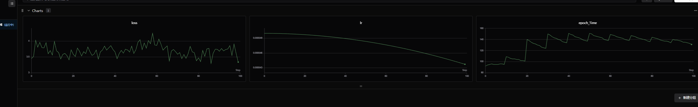
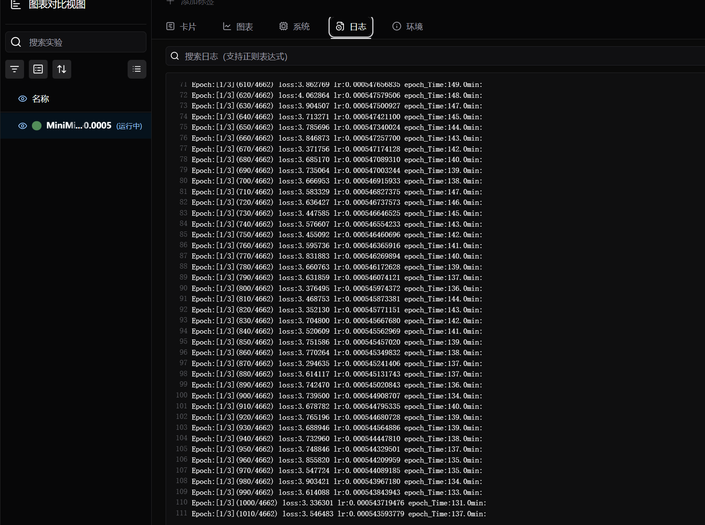

## 第二章 预训练
### 一个预训练模板
训练完分词器后，我们需要先回退一层文件夹结构：
`cd ..`
之后再在训练脚本train_pretrain.py的同级目录下，创建一个叫train.sh的脚本
```																	
python train_pretrain.py \
 --out_dir "weights" \
 --device "cuda:0" \
 --epochs 1 \
 --batch_size 32 \
 --learning_rate 5e-4 \
 --accumulation_steps 8 \
 --log_interval 100 \
 --save_interval 100 \
 --data_path "./dataset/pretrain_hq.jsonl"
```
### wdb配置
SwanLab 是一款开源、轻量的 AI 模型训练跟踪与可视化工具，提供了一个跟踪、记录、比较、和协作实验的平台。SwanLab 面向人工智能研究者，设计了友好的Python API 和漂亮的UI界面，并提供训练可视化、自动日志记录、超参数记录、实验对比、多人协同等功能。在SwanLab上，研究者能基于直观的可视化图表发现训练问题，对比多个实验找到研究灵感，并通过在线网页的分享与基于组织的多人协同训练，打破团队沟通的壁垒，提高组织训练效率。
借助SwanLab，科研人员可以沉淀自己的每一次训练经验，与合作者无缝地交流和协作，机器学习工程师可以更快地开发可用于生产的模型。
原作者进行了wab配置，可以在云上监控训练进度与效果，在使用wdb前，你需要在运行指令种种加入
`--use_wdb`
以启用该功能，swdb需要注册使用，使用微信号即可
https://docs.swanlab.cn/api/py-openapi.html，
执行训练代码后，登上这个链接点击官网，就能看到相关可视化训练进程




执行：<br>
`bash train.sh`<br>
就可以开始训练了，代码中有很多重要参数可以通过自己设置，来定义我们想要的模型规模、训练数据集文件、训练轮次、或者是否使用MoE模型等。可以自定义的参数一起作用如表所示：
| 参数名称 | 描述 | 默认值 | 类型 |
|----------|------|--------|------|
| --out_dir | 输出目录：保存模型检查点和其他输出文件的根目录。 | "out" | str |
| --epochs | 训练轮数：数据集的完整遍历次数。Zero-Shot 推理可设为 1，否则建议 2~6 轮。 | 1 | int |
| --batch_size | 批次大小：每个 GPU/进程在一次前向/反向传播中处理的样本数。 | 32 | int |
| --learning_rate | 学习率：优化器使用的初始学习率。 | 5e-4 | float |
| --device | 运行设备：指定训练使用的设备，例如 "cuda:0" 或 "cpu"。 | "cuda:0" (如果可用) | str |
| --dtype | 数据类型：用于混合精度训练的数据类型，例如 "bfloat16" 或 "float16"。 | "bfloat16" | str |
| --use_wandb | 使用 Wandb：布尔标志，启用 Weights & Biases 进行实验跟踪。 | False (action='store_true') | bool |
| --wandb_project | Wandb 项目名称：记录实验时使用的项目名称。 | "MiniMind-Pretrain" | str |
| --num_workers | 数据加载器工作进程数：用于并行加载数据的子进程数量。 | 1 | int |
| --ddp | 使用 DDP：布尔标志，启用分布式数据并行模式。 | False (action='store_true') | bool |
| --accumulation_steps | 梯度累积步数：在执行一次优化器更新之前累积的梯度步数，相当于增大有效批次大小。 | 8 | int |
| --grad_clip | 梯度剪裁阈值：限制梯度的最大范数，防止训练过程中梯度爆炸。 | 1.0 | float |
| --warmup_iters | 学习率预热迭代次数：训练开始时，学习率从零线性增加到初始学习率的步数。 | 0 | int |
| --log_interval | 日志间隔：每隔多少步打印一次训练状态日志。 | 100 | int |
| --save_interval | 保存间隔：每隔多少步保存一次模型检查点。 | 100 | int |
| --local_rank | 本地进程 ID：DDP 模式下当前进程在节点内的 ID，-1 表示未设置。 | -1 | int |
| --dim | 模型维度：LLM 模型的隐藏层维度或特征大小。 | 512 | int |
| --n_layers | 模型层数：LLM 模型中 Transformer 块的数量。 | 8 | int |
| --max_seq_len | 最大序列长度：模型能处理的最大输入 token 数量。 | 512 | int |
| --use_moe | 使用 MoE：布尔标志，启用 Mixture-of-Experts 架构。 | False | bool |
| --data_path | 数据路径：指向用于预训练的 .jsonl 格式数据集文件路径。 | "./dataset/pretrain_hq.jsonl" | str |

注意，第144行代码：<br>
`lm_config = LMConfig(dim=args.dim, n_layers=args.n_layers, max_seq_len=args.max_seq_len, use_moe=args.use_moe)`<br>
可以增加参数`dropout = 0.1`否则就是代码的默认值为0。
### 训练时间对比
（因资源原因这边会之后继续补充）
|处理器|显卡|批次大小|显卡数|训练轮次|训练时间|参数量（百万）|
|----------|------|---|------|------|---|---|
| Intel(R) Core(TM) i7-9750H CPU @ 2.60GHz   2.59 GHz（我的电脑） |NVIDIA GeForce GTX 1650 (4 GB), Intel(R) UHD Graphics 630 (128 MB)| 16 |1| 1 | 无法运行|20.07|
| Intel(R) Xeon(R) Gold 6148 CPU @ 2.40GHz | NVIDIA A40 (46 GB) | 16 | 1 |1|30min|28.07|
| Intel(R) Xeon(R) Gold 6148 CPU @ 2.40GHz | NVIDIA A40 (46 GB) | 32 | 1 |2|20h|183.797 |
| Intel(R) Xeon(R) Gold 6148 CPU @ 2.40GHz | NVIDIA A40 (46 GB) | 64 | 1 |3|48h|272.418|
| AMD Ryzen 9 8945HX with Radeon Graphics         (2.50 GHz)| RTX 5060 (8 GB) | 16 | 1 |1|18h|272.418|
| AMD Ryzen 9 8945HX with Radeon Graphics         (2.50 GHz)| RTX 5060 (8 GB) | 8 | 1 |1|无法运行|380M|