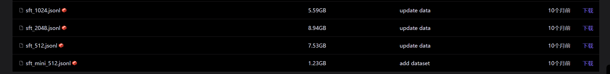

## 第三章 监督微调
SFT（Supervised Fine-Tuning）监督微调是指在源数据集上预训练一个神经网络模型，即源模型。然后创建一个新的神经网络模型，即目标模型。目标模型复制了源模型上除了输出层外的所有模型设计及其参数。这些模型参数包含了源数据集上学习到的知识，且这些知识同样适用于目标数据集。源模型的输出层与源数据集的标签紧密相关，因此在目标模型中不予采用。微调时，为目标模型添加一个输出大小为目标数据集类别个数的输出层，并随机初始化该层的模型参数。在目标数据集上训练目标模型时，将从头训练到输出层，其余层的参数都基于源模型的参数微调得到。
### 代码运行


需要下载如下的数据集，但是按照sft概念定义，sft主要是为了让模型输出结构化的知识，他不能覆盖模型预训练阶段学到的主要知识，原作者给的sft数据量远远大过了预训练数据总量，这会导致模型发生大规模只是遗忘，尤其对于我们算力有限小模型尤为明显。因此重新对数据进行可预处理，只从原数据挑选了少量数据集。 注： 
按照网上的以Open AI ，谷歌等公司公开表明，sft数据量与预训练数据量应该为1：1000或1：10000


```																	
def sample_jsonl_by_size(
    input_path,
    output_path,
    target_mb=50, #压缩目标数据文件大小
    seed=42       #随机种子
):
    random.seed(seed)

    target_bytes = target_mb * 1024 * 1024
    selected = []
    current_size = 0

    # 先读取所有样本
    with open(input_path, "r", encoding="utf-8") as f:
        lines = f.readlines()

    random.shuffle(lines)

    for line in lines:
        line = line.strip()
        if not line:
            continue

        byte_size = len(line.encode("utf-8"))

        if current_size + byte_size > target_bytes:
            break

        selected.append(line)
        current_size += byte_size

    # 写出新的 jsonl
    with open(output_path, "w", encoding="utf-8") as f:
        for line in selected:
            f.write(line + "\n")

    print(f"抽样完成")
    print(f"样本数: {len(selected)}")
    print(f"目标大小: {target_mb} MB")
    print(f"实际大小: {current_size / 1024 / 1024:.2f} MB")


if __name__ == "__main__":
    sample_jsonl_by_size(
        input_path="/home/liuyuan/minimind/dataset/sft_mini_512.jsonl",
        output_path="/home/liuyuan/minimind/dataset/sft_mini_512_72mb.jsonl",
        target_mb=72
    )

```
以上代码是用于压缩sft数据所写的，随机挑选原有数据集中的数据，作为新训练样本，我在这里保存为了sft_mini_512_72mb.jsonl

```																	
nohup python train_full_sft.py \
    --epochs 3 \
    --hidden_size 2048 \
    --device cuda:7 \
    --batch_size 16 \
    --learning_rate 5e-4 \
    --accumulation_steps 8 \
    --log_interval 10 \
    --save_interval 100 \
    --data_path ../dataset/sft_mini_512_72mb.jsonl \
    --num_hidden_layers 20 \
    --use_wandb \
    --from_weight weights_12_9 \
    > train_sft.log 2>&1 &

```
同样的，运行指令的相关模型超参数与之前差不多一样